# Empathetech Flutter UI <br><br> Build apps for anyone

EFUI is a holistic foundation for digital accessibility.

EFUI provides a starter kit for every aspect of digital accessibility:
- **Platform availability**
  - Thanks to Flutter, EFUI is fully cross platform! EFUI can build apps for Android, iOS, Linux, MacOS, Windows and Web!
    - Thanks to integration with [Flutter Platform Widgets](https://pub.dev/packages/flutter_platform_widgets), apps built with EFUI will gracefully adapt to Cupertino (Apple) and Material (Android and beyond) styling
- **Screen reader compliance**
  - The [example app](./example/lib/screens/) and all [custom widgets](./lib/src/classes/) have been manually verified with [TalkBack](https://support.google.com/accessibility/android/answer/6006598?hl=en) and [VoiceOver](https://support.apple.com/guide/iphone/turn-on-and-practice-voiceover-iph3e2e415f/ios)
- **User customization**
  - The only way to be truly accessible for ALL customers is to empower them with the freedom of choice.<br>EFUI enables you to expose any aspect of your app's theme to the user.
    - Users can have full control of theme colors, fonts, styling, spacing, and images.
- **Internationalization**
  - The [example app](./example/lib/l10n/) and all [custom widgets](./lib/src/l10n/) have been translated into Spanish. With the [infrastructure](./l10n.yaml) for internationalization laid out, the only work left are the translations themselves.
    - Moral fiber moment: Remember that LLMs are a tool for acceleration. But, there's a lot more to winning a race than acceleration. If your translations are A.H.I. generated, disclose that. EFUI's translations started with A.H.I. and ended with [H.I.](https://www.linkedin.com/in/mauro-ramirez-rivas)
- **Responsive design**
  - Here's the [definition](https://developer.mozilla.org/en-US/docs/Learn/CSS/CSS_layout/Responsive_Design)
  - Checkout the [demo](#responsive-design) to see it in action

<br>When built with EFUI, your apps can truly reach any audience. Let's make the internet a more accessible place together!

## Table of Contents

* [Installation](#installation)
* [Usage](#usage)
* [Demo](#demo)
* [Contributing](#contributing)
* [License](#license)
* [Credits](#credits)

# Installation

In your app's base directory, run

```bash
flutter pub add empathetech_flutter_ui
```

And add the following import to any files that use EFUI's library!

```Dart
import 'package:empathetech_flutter_ui/empathetech_flutter_ui.dart';
```

## Beginner tutorials

If you're new to Flutter: welcome! The example app is full of comments to help you on your path.

Here are some (unaffilliated!) videos you might also find helpful.

- [First app tutorial](https://www.youtube.com/watch?v=xWV71C2kp38)
- [First app codelab](https://www.youtube.com/watch?v=8sAyPDLorek)
- [Using external packages](https://www.youtube.com/watch?v=WdXcJdhWcEY)

# Usage

## TL;DR

1. a) Add any imports you're missing from the header below to your `main.dart` and<br>b) Initialize [EzConfig](./lib/src/classes/EzConfig.dart) in your `void main()` to setup the user customizable [ezThemeData](./lib/src/functions/ezThemeData.dart)
2. Use an [EzAppProvider](./lib/src/classes/EzAppProvider.dart) to build your [PlatformApp](https://pub.dev/documentation/flutter_platform_widgets/latest/flutter_platform_widgets/PlatformApp-class.html)<br>OR use `ezThemeData` in your existing provider/app
3. a) Copy/paste all example app [screens](./example/lib/screens/) and [.arbs](./example/lib/l10n/) to your app and<br>b) Rename `Home.dart` to `Settings.dart` (personal preference) and update your routes
4. Enjoy

## Setup

### Step 1

In your [main.dart](./example/lib/main.dart) add any imports you're missing...

```Dart
import 'utils/utils.dart';
import 'screens/screens.dart';

import 'package:empathetech_flutter_ui/empathetech_flutter_ui.dart';

import 'package:flutter/material.dart';
import 'package:flutter/services.dart';
import 'package:go_router/go_router.dart';
import 'package:shared_preferences/shared_preferences.dart';
import 'package:flutter_platform_widgets/flutter_platform_widgets.dart';
```

...and initialize `EzConfig` in your `void main()` Function.

```Dart
void main() async {
  WidgetsFlutterBinding.ensureInitialized();

  final SharedPreferences prefs = await SharedPreferences.getInstance();

  EzConfig(
    // Paths to any locally stored images the app uses
    assetPaths: [],

    preferences: prefs,

    // Your brand colors, custom styling, etc
    customDefaults: {},
  );
  
  SystemChrome.setPreferredOrientations([
    DeviceOrientation.portraitUp,
    DeviceOrientation.landscapeLeft,
    DeviceOrientation.landscapeRight,
  ]);

  runApp(const EFUIExample());
}
```

#### How it works

`EzConfig` gathers all the values for `ezThemeData` and creates an instance for efficiently getting and setting those values in app.<br><br>`EzConfig` starts with [Empathetech's config](./lib/src/consts/empathetechConfig.dart) to make sure every key has a value. Then it merges in your custom data and the user's current [preferences](https://pub.dev/packages/shared_preferences). The [finalized](https://flutterbyexample.com/lesson/const-and-final-variables) instance is then used to populate `ezThemeData`.

### Step 2

In `main.dart`, use an [EzAppProvider](./lib/src/classes/EzAppProvider.dart) to build your [PlatformApp](https://pub.dev/documentation/flutter_platform_widgets/latest/flutter_platform_widgets/PlatformApp-class.html)

```Dart
class EFUIExample extends StatelessWidget {
  final Key? key;

  const EFUIExample({this.key}) : super(key: key);

  @override
  Widget build(BuildContext context) {
    return EzAppProvider(
      app: PlatformApp.router(
        debugShowCheckedModeBanner: false,

        // Supported languages
        supportedLocales: Phrases.supportedLocales + EFUIPhrases.supportedLocales,

        // Language handlers
        localizationsDelegates:
            Phrases.localizationsDelegates + EFUIPhrases.localizationsDelegates,

        title: "Emapathetech Flutter UI",
        routerConfig: _router,
      ),
    );
  }
}
```

#### How it works

[EzAppProvider](./lib/src/classes/EzAppProvider.dart) is a [PlatformProvider](https://pub.dev/documentation/flutter_platform_widgets/latest/flutter_platform_widgets/PlatformProvider-class.html) wrapper that uses `ezThemeData` by default, setup for Cupertino and Material.

You are more than welcome to use your own app/app provider with `ezThemeData` for the same effect. `EzAppProvider` and [Flutter Platform Widgets](https://pub.dev/packages/flutter_platform_widgets) are recommendations not requirements.

### Step 3

#### Copy the [settings sandbox](#user-customization)!

The example app is built to be a drop-in solution for your app's settings section.

Copy/paste all the [screen](./example/lib/screens/) files, [.arb](./example/lib/l10n/) language files, and routes from `main.dart` (aka below)

```Dart
// Initialize a path based router for web-enabled apps
// Or any other app that requires deep linking
// https://docs.flutter.dev/ui/navigation/deep-linking
final GoRouter _router = GoRouter(
  initialLocation: homeRoute,
  routes: <RouteBase>[
    GoRoute(
      name: homeRoute,
      path: homeRoute,
      builder: (BuildContext context, GoRouterState state) {
        return const HomeScreen();
      },
      routes: <RouteBase>[
        GoRoute(
          name: styleSettingsRoute,
          path: styleSettingsRoute,
          builder: (BuildContext context, GoRouterState state) {
            return const StyleSettingsScreen();
          },
        ),
        GoRoute(
          name: colorSettingsRoute,
          path: colorSettingsRoute,
          builder: (BuildContext context, GoRouterState state) {
            return const ColorSettingsScreen();
          },
        ),
        GoRoute(
          name: imageSettingsRoute,
          path: imageSettingsRoute,
          builder: (BuildContext context, GoRouterState state) {
            return const ImageSettingsScreen();
          },
        ),
      ],
    ),
  ],
);
```

Rename the (just copied) `Home.dart` and `HomeScreen()` to something more appropriate, like `Settings.dart` and `SettingsScreen()`, create a link to it in your app, and boom!

**It's that Ez!**

#### How it works

The example app's screens neatly organize all the custom widgets that enable EFUI's user customization!

* [EzThemeModeSwitch](./lib/src/classes/EzThemeModeSwitch.dart): A toggle for switching between light, dark, and system theming.
* [EzDominantHandSwitch](./lib/src/classes/EzDominantHandSwitch.dart): A toggle for switching common touch points to benefit lefties.
* [EzColorSetting](./lib/src/classes/EzColorSetting.dart): A color picker for updating theme colors.
* [EzFontSetting](./lib/src/classes/EzFontSetting.dart): A list of available [Google Fonts](https://pub.dev/packages/google_fonts) for the app to use.
* [EzSliderSetting](./lib/src/classes/EzSliderSetting.dart): A versatile slider widget, with a live preview, for updating numerical theme values (spacing, sizing, etc).
* [EzImageSetting](./lib/src/classes/EzImageSetting.dart): An image uploader for updating app assets.
* [EzResetButton](./lib/src/classes/EzResetButton.dart): A text button for resetting groups of preferences.

By default, every base [theme setting](./lib/src/consts/sharedPreferences.dart) is exposed. Any keys provided to `customDefaults` can be updated with these `EzSetting`s. If there are any theme values you wish to stay constant, simply remove the paired `EzSetting`.

### Step 4

Enjoy!

There's lots of other cool stuff in EFUI, like [EzRowCol](./lib/src/classes/EzRowCol.dart), [EzLayoutSwitch](./lib/src/classes/EzLayoutSwitch.dart), and [EzVideoPlayer](./lib/src/classes/EzVideoPlayer.dart)! We think `EzConfig` will hook you in enough to want to explore the rest!

# Demo

## From the example

### Platform availability

| Android | iOS |
|---|---|
| 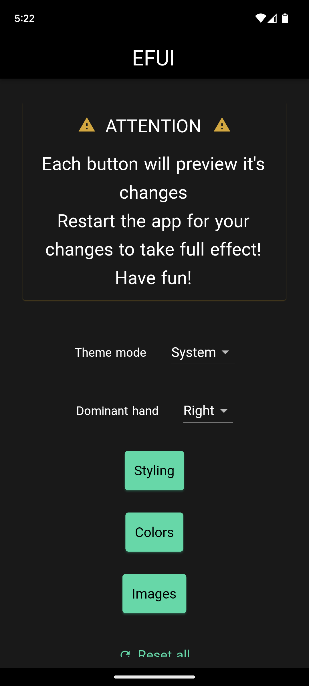 | 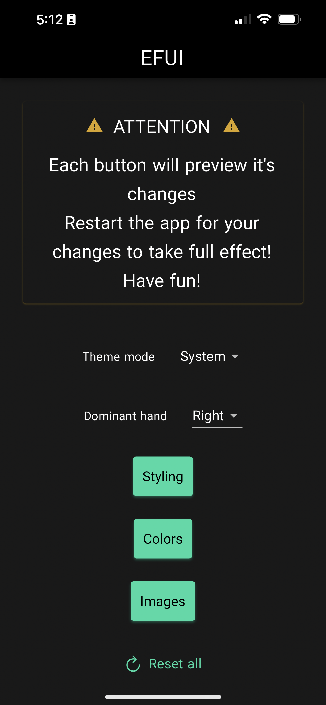 |

| Linux | MacOS | Windows |
|---|---|---|
| 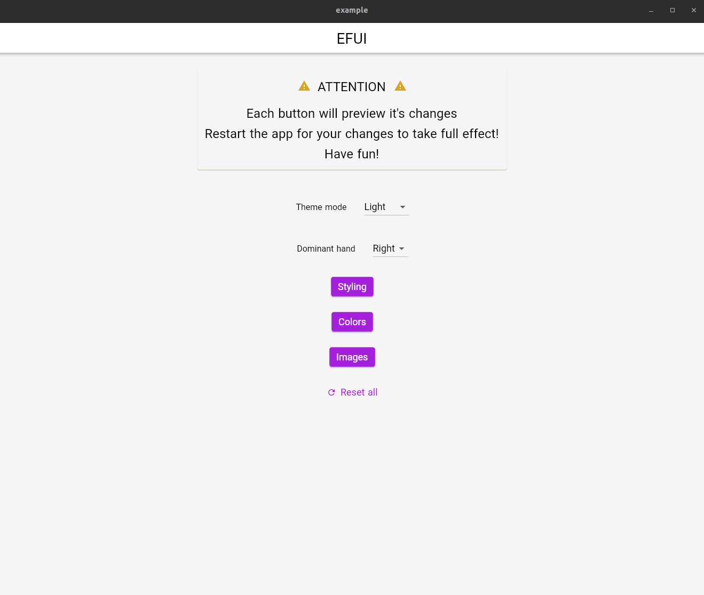 | 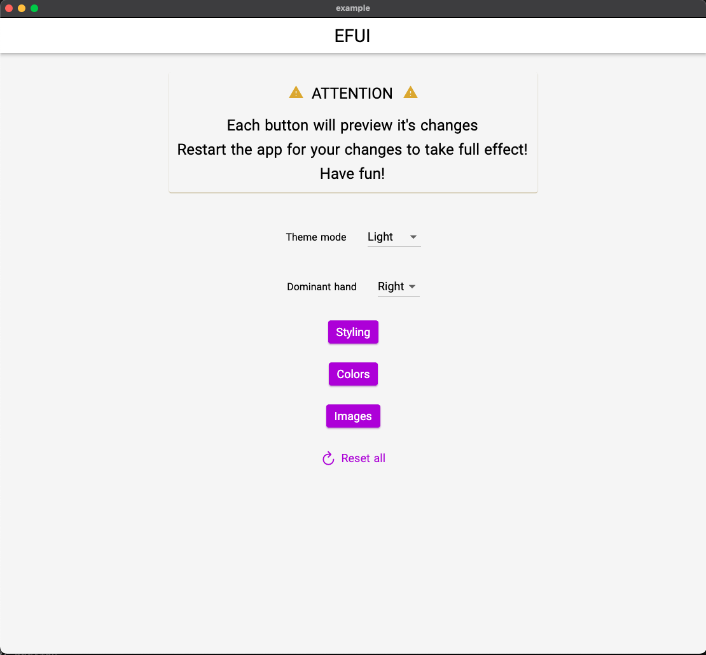 | 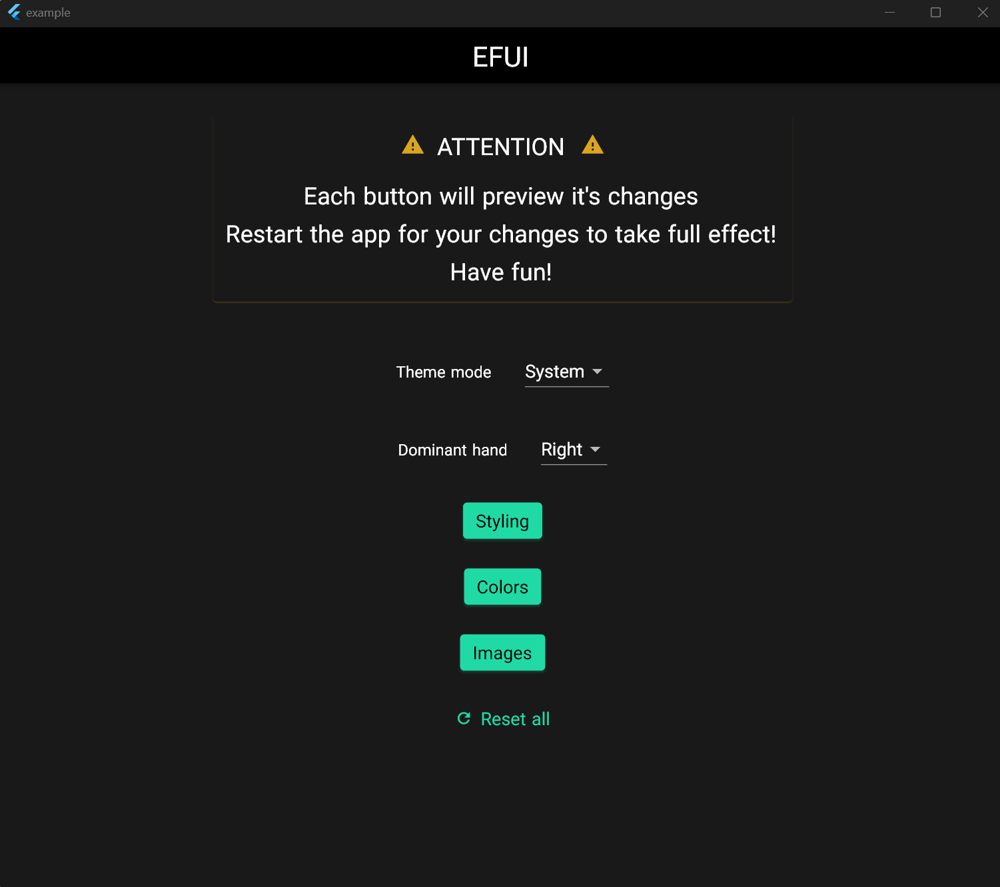 |

| Web |
|---|
| 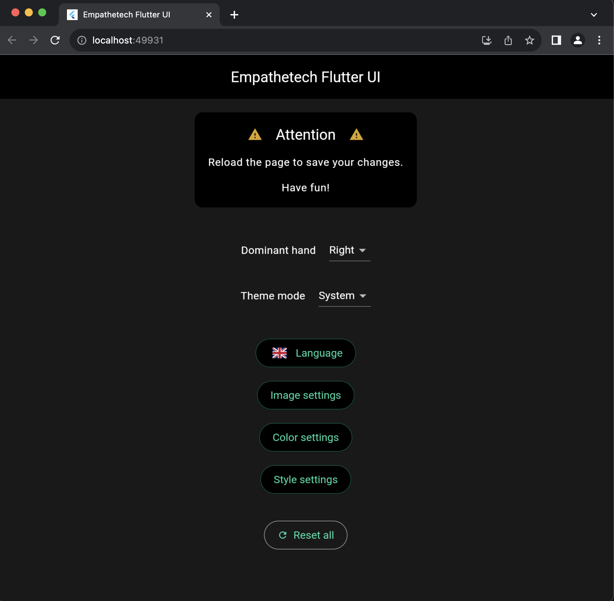 |

### Screen reader compliance

<video width="350" controls aria-label="iOS voice over demo">
  <source src="./assets/videos/en-voice-over.mp4" type="video/mp4">
</video>

### User customization

| | | |
|---|---|---|
|  | 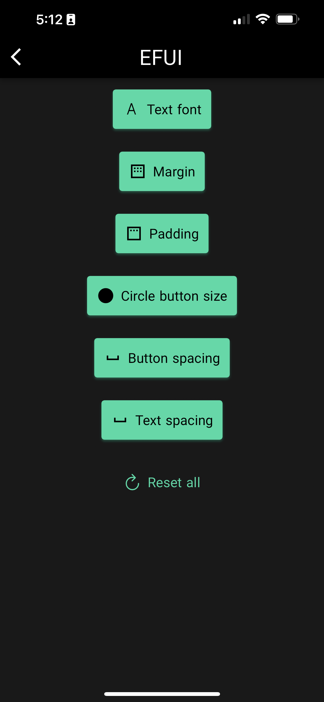 | 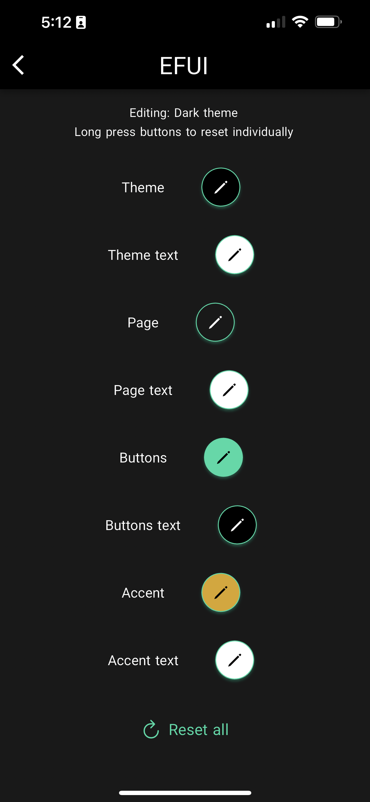 |
| 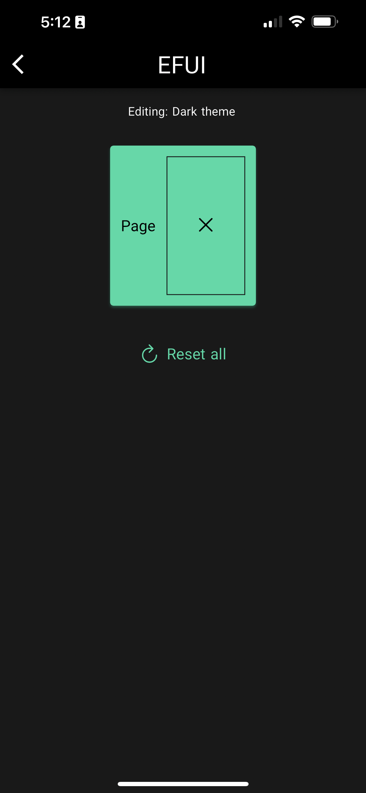 | 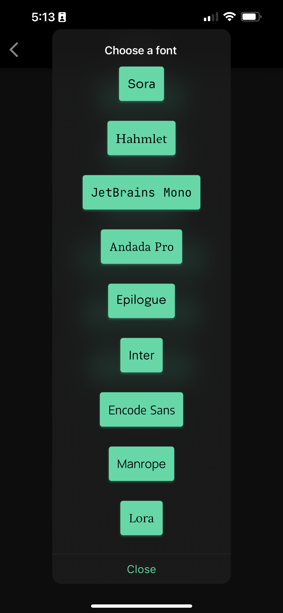 | 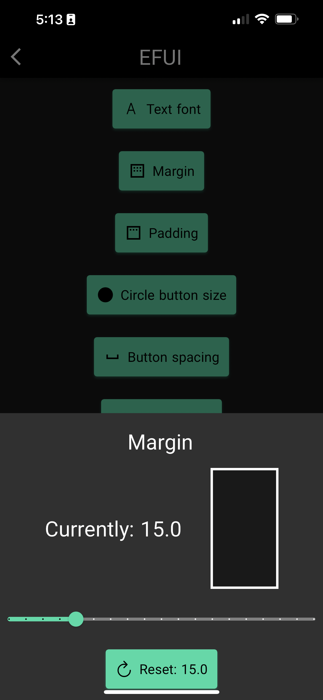 |
| 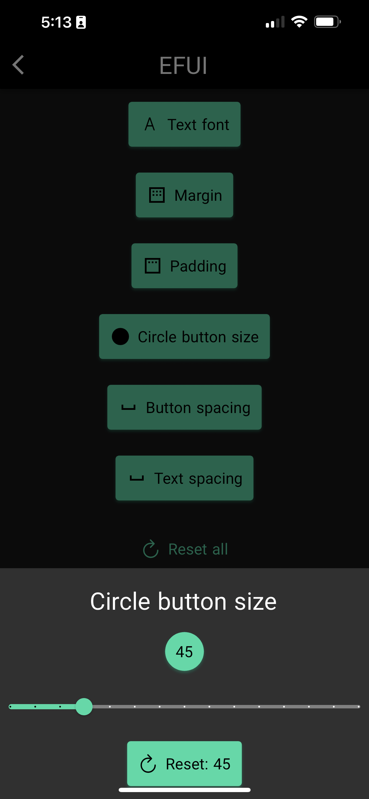 | 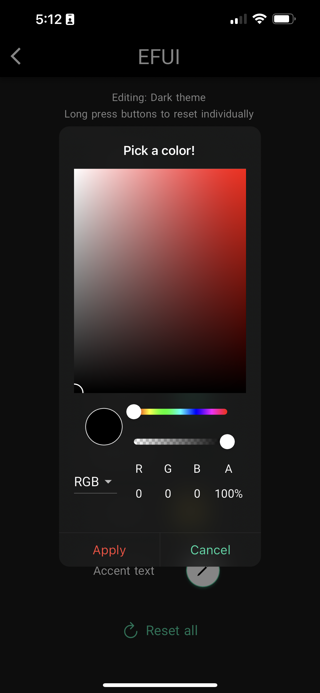 | 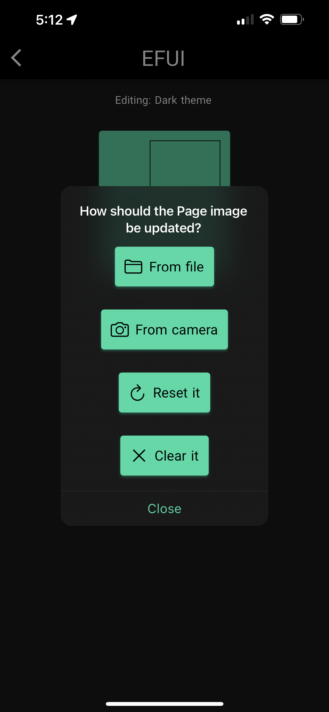 |

### Internationalization

| | | | |
|---|---|---|---|
| 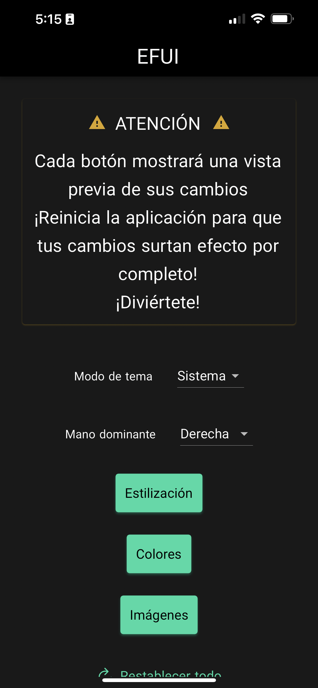 | 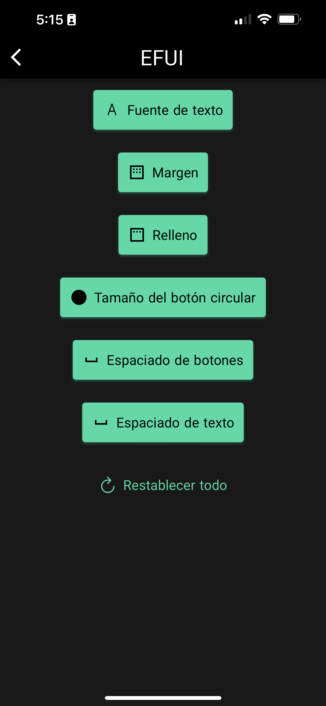 | 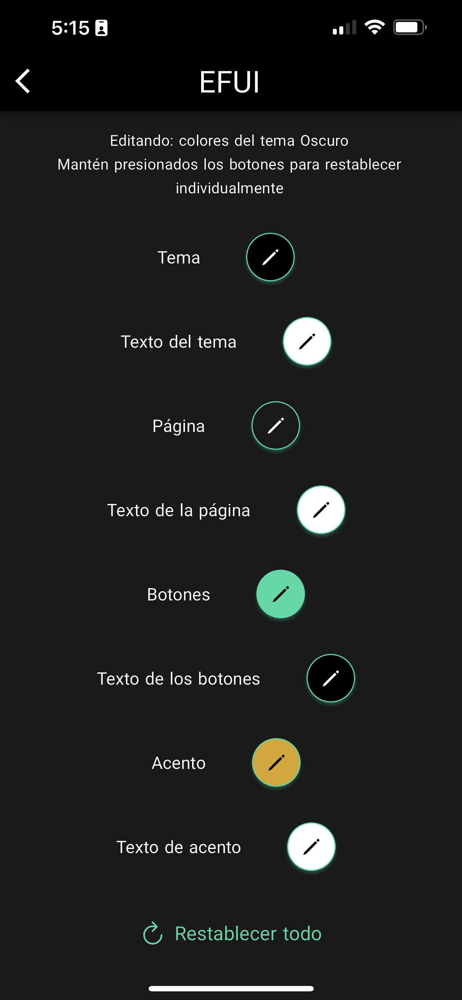 | 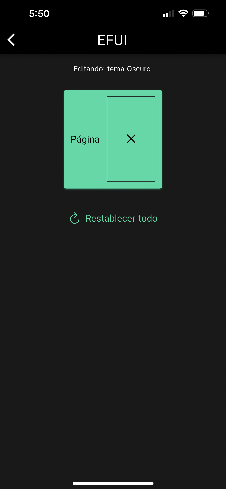 |

**Screen reader semantics are also internationalized!**

### Responsive design

Checkout the link to our site below. If you're using a monitor, play around with the window size! Using a phone or tablet? Rotate your device!

## Live

* [Company site](https://www.empathetech.net/#/settings)
  * [Source code](https://github.com/Empathetech-LLC/dotnet-public)

# Contributing

## The vibes!

If you build something with EFUI, let us know! We'd love to have a third-party live section

## Time

Please reach out to the [community](mailto:community@empathetech.net?subject=Becoming%20a%20contributor) contact about becoming a contributor. Emapthetech LLC doesn't tend to run out of ideas, only time! Here are a few current...

### Planned features

- More languages! If you speak English and a currently unsupported language, please reach out!
- More EzWidgets with required and/or preconfigured semantics
- Querying [GoogleFonts](https://pub.dev/packages/google_fonts) rather than relying on a predetermined [list](/lib/src/consts/googleFonts.dart)

## Money

Many thanks for any and all donations! We're happy to have helped!

### Paypal

[](https://www.paypal.com/donate/?hosted_button_id=NGEL6AB5A6KNL)

### Venmo

[@empathetech-llc](https://venmo.com/empathetech-llc)

### Cash App

[$empathetech](https://cash.app/$empathetech)

# License

[GNU GPLv3](LICENSE)

# Credits

## Translations

Thank you to [M Ramirez](https://www.linkedin.com/in/mauro-ramirez-rivas) for verifying EFUI's [Spanish](./lib/src/l10n/efui_es.arb) translations!

## Flutter OSS

EFUI wouldn't be as awesome as it is without these other awesome community projects...

* [Flutter Platform Widgets](https://pub.dev/packages/flutter_platform_widgets)
* [Flutter Colorpicker](https://pub.dev/packages/flutter_colorpicker)
* [Line Icons](https://pub.dev/packages/line_icons)
* [Flutter Toast](https://pub.dev/packages/fluttertoast)

And, of course, all the awesome Flutter (Google) devs.
