# Empathetech Flutter UI <br><br> Build apps for anyone

EFUI is a starter kit for building apps with a strong foundation in every pillar of digital accessibility:

- **Platform availability**
  - Thanks to Flutter, EFUI is fully cross platform! EFUI can build apps for Android, iOS, Linux, MacOS, Windows and Web!
    - Thanks to integration with [Flutter Platform Widgets](https://pub.dev/packages/flutter_platform_widgets), apps built with EFUI will gracefully adapt to Cupertino (Apple) and Material (Android and beyond) styling
- **Responsive design**
  - Here's the [definition](https://developer.mozilla.org/en-US/docs/Learn/CSS/CSS_layout/Responsive_Design)
  - Checkout the [demo](#live) to see it in action
- **Screen reader support**
  - All custom Widgets and the example app have been manually verified with [TalkBack](https://support.google.com/accessibility/android/answer/6006598?hl=en) and [VoiceOver](https://support.apple.com/guide/iphone/turn-on-and-practice-voiceover-iph3e2e415f/ios)
- **User customization**
  - The only way to be truly accessible for ALL customers is to empower them with the freedom of choice.
    - EFUI enables developers to expose full control over theme colors, fonts, styling, spacing, and images to their users.
- **Internationalization**
  - All of EFUI's [external text](./lib/src/l10n/) has been translated to Spanish. With the [infrastructure](./l10n.yaml) for internationalization laid out, the only work left are the translations themselves.
    - Moral fiber moment: Remember that LLMs are a tool for acceleration. But, there's a lot more to winning a race than acceleration. If your translations are generated, disclose that. EFUI's translations started with A.H.I. and ended with [H.I.](#translations)


<br>When built with EFUI, apps can truly reach any audience. Let's make the internet a more accessible place together!

## Table of Contents

* [Installation](#installation)
* [Usage](#usage)
* [Demo](#demo)
* [Contributing](#contributing)
* [License](#license)
* [Credits](#credits)

# Installation

In your app's base directory, run

```bash
flutter pub add empathetech_flutter_ui
```

And add the following import to any files that use EFUI's library

```Dart
import 'package:empathetech_flutter_ui/empathetech_flutter_ui.dart';
```

## Beginner tutorials

If you're new to Flutter: welcome! The example app is full of comments to help you on your path.

Here are some (unaffiliated) videos you might also find helpful.

- [First app tutorial](https://www.youtube.com/watch?v=xWV71C2kp38)
- [First app code lab](https://www.youtube.com/watch?v=8sAyPDLorek)
- [Using external packages](https://www.youtube.com/watch?v=WdXcJdhWcEY)

# Usage

## TL;DR

--- Required ---
1. Initialize [EzConfig](./lib/src/classes/user-customization/EzConfig.dart) in `void main()`
2. Use [EzAppProvider](./lib/src/classes/user-customization/EzAppProvider.dart) to build a [PlatformApp](https://pub.dev/documentation/flutter_platform_widgets/latest/flutter_platform_widgets/PlatformApp-class.html)<br>  - OR use [ezThemeData](./lib/src/functions/themeData.dart) in any existing provider/app<br>  - OR use `EzConfig` to build a custom `ThemeData`

<br>--- Recommended ---
1. Copy all example app [settings screens](./example/lib/screens/) to your project
2. Enjoy

## Setup

### Step 1

Initialize `EzConfig` in `void main()` (in [main.dart](./example/lib/main.dart))

```Dart
void main() async {
  WidgetsFlutterBinding.ensureInitialized();

  final SharedPreferences prefs = await SharedPreferences.getInstance();

  EzConfig(
    // Paths to any locally stored images the app uses
    assetPaths: {},

    preferences: prefs,

    // Your brand colors, custom styling, etc
    customDefaults: {},
  );
  
  SystemChrome.setPreferredOrientations([
    DeviceOrientation.portraitUp,
    DeviceOrientation.landscapeLeft,
    DeviceOrientation.landscapeRight,
  ]);

  runApp(const EFUIExample());
}
```

#### How it works

`EzConfig` gathers and stores the app's theme data.

`EzConfig` starts with [Empathetech's config](./lib/src/consts/EzConfigValues.dart), then merges in your `customDefaults`, and the user's saved [preferences](https://pub.dev/packages/shared_preferences).

Once gathered, `EzConfig` stores the data in a Singleton instance for efficient access. `EzConfig` has a series of getter and setter methods for safe interactions with the theme data.

### Step 2

In `main.dart`, use an [EzAppProvider](./lib/src/classes/user-customization/EzAppProvider.dart) to build your [PlatformApp](https://pub.dev/documentation/flutter_platform_Widgets/latest/flutter_platform_Widgets/PlatformApp-class.html)

```Dart
class EFUIExample extends StatelessWidget {
  final Key? key;

  const EFUIExample({this.key}) : super(key: key);

  @override
  Widget build(BuildContext context) {
    return EzAppProvider(
      app: PlatformApp.router(
        debugShowCheckedModeBanner: false,

        // Language handlers
        localizationsDelegates: {
          LocaleNamesLocalizationsDelegate(),
          ...EFUILang.localizationsDelegates,
        },

        // Supported languages
        supportedLocales: EFUILang.supportedLocales,

        // Current language
        locale: EzConfig.getLocale(),

        title: efuiL,
        routerConfig: _router,
      ),
    );
  }
}
```

#### How it works

`EzAppProvider` is a [PlatformProvider](https://pub.dev/documentation/flutter_platform_Widgets/latest/flutter_platform_Widgets/PlatformProvider-class.html) wrapper that uses [ezThemeData](./lib/src/functions/themeData.dart) by default.

`ezThemeData` sets up the dynamic color scheme, a readable text theme, and updates some touch points to be higher contrast by default.

You are more than welcome to use your own app/app provider with `ezThemeData` for the same effect.

Or, you can even build your own fully custom base theme with `EzConfig` data.

### Step 3

#### Copy the [settings sandbox](#user-customization)!

The example app is built to be a drop-in solution for your apps' settings sections.

Copy/paste all the [screen files](./example/lib/screens/) and routes from `main.dart` (below)

```Dart
// Initialize a path based router for web-enabled apps
// Or any other app that requires deep linking
// https://docs.flutter.dev/ui/navigation/deep-linking
final GoRouter _router = GoRouter(
  initialLocation: homeRoute,
  routes: <RouteBase>[
    GoRoute(
      name: homeRoute,
      path: homeRoute,
      builder: (BuildContext context, GoRouterState state) {
        return const HomeScreen();
      },
      routes: <RouteBase>[
        GoRoute(
          name: styleSettingsRoute,
          path: styleSettingsRoute,
          builder: (BuildContext context, GoRouterState state) {
            return const StyleSettingsScreen();
          },
        ),
        GoRoute(
          name: colorSettingsRoute,
          path: colorSettingsRoute,
          builder: (BuildContext context, GoRouterState state) {
            return const ColorSettingsScreen();
          },
        ),
        GoRoute(
          name: imageSettingsRoute,
          path: imageSettingsRoute,
          builder: (BuildContext context, GoRouterState state) {
            return const ImageSettingsScreen();
          },
        ),
      ],
    ),
  ],
);
```

Rename the (just copied) `Home.dart` file and `HomeScreen()` class to something more appropriate; like `Settings.dart` and `SettingsScreen()`. Then, create a link to `SettingsScreen` in your app, and, boom!

**It's that Ez!**

#### How it works

The example app's screens neatly organize all the custom Widgets that enable EFUI's user customization!

* [EzDominantHandSwitch](./lib/src/classes/user-customization/EzDominantHandSwitch.dart): A toggle for switching common touch points to benefit lefties.
* [EzThemeModeSwitch](./lib/src/classes/user-customization/EzThemeModeSwitch.dart): A toggle for switching between light, dark, and system theming.
* [EzLocaleSetting](./lib/src/classes/user-customization/EzLocaleSetting.dart): A menu for updating the app's language.
* [EzImageSetting](./lib/src/classes/user-customization/EzImageSetting.dart): An image uploader for updating app assets.
* [EzColorSetting](./lib/src/classes/user-customization/EzColorSetting.dart): A color picker for updating theme colors.
* [EzFontSetting](./lib/src/classes/user-customization/EzFontSetting.dart): A list of available [Google Fonts](https://pub.dev/packages/google_fonts) for the app to use.
* [EzSliderSetting](./lib/src/classes/user-customization/EzSliderSetting.dart): A versatile slider Widget, with a live preview, for updating numerical theme values (spacing, sizing, etc).
* [EzResetButton](./lib/src/classes/user-customization/EzResetButton.dart): A text button for resetting groups of preferences.

By default, every base [theme setting](./lib/src/consts/EzConfigKeys.dart) is exposed. Additional keys provided to `customDefaults` can be updated with these Widgets as well!

If there are any theme values you wish to stay constant, simply remove the paired setting Widget(s).

### Step 4

**Enjoy!**

The pillars of **platform availability** and **user customization** are "set it and forget it"; bar any external libraries that break things.

But, as you grow your apps, the other pillars require continuous development.

Thankfully, EFUI's got you covered there too!
* [Responsive design](./lib/src/classes/responsive-design/): Widgets that aid in building responsive UI/UXs
* [Screen reader support](./lib/src/classes/accessibility/): Widgets with streamlined semantics

But, this should be plenty to get you started (and avoid overload). Once you're feeling settled, the code has been organized to aid in exploration!

# Demo

## Live

* [Company site](https://www.empathetech.net/#/settings)
  * [Source code](https://github.com/Empathetech-LLC/dotnet-public)

## From the example

### Platform availability

| Android | iOS |
|---|---|
| 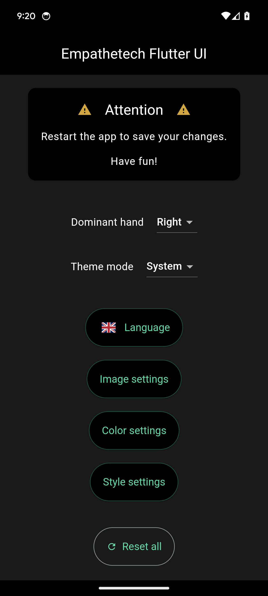 | 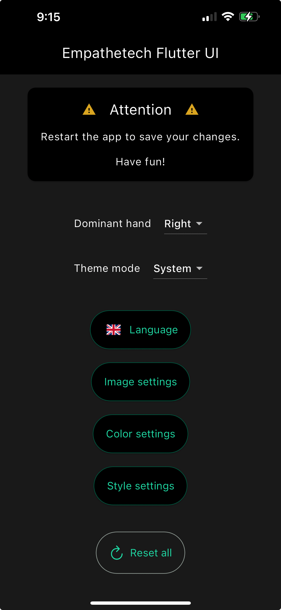 |

| Linux | MacOS | Windows |
|---|---|---|
| 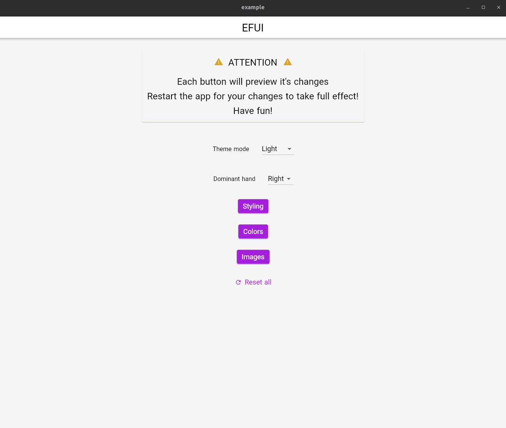 | 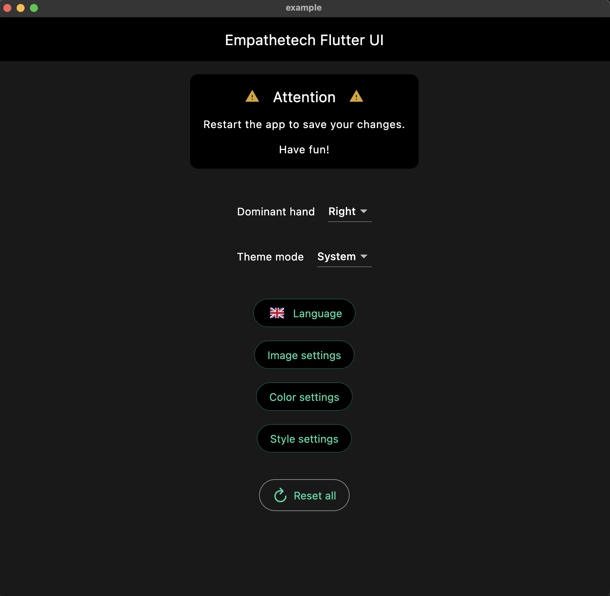 |  |

| Web |
|---|
| 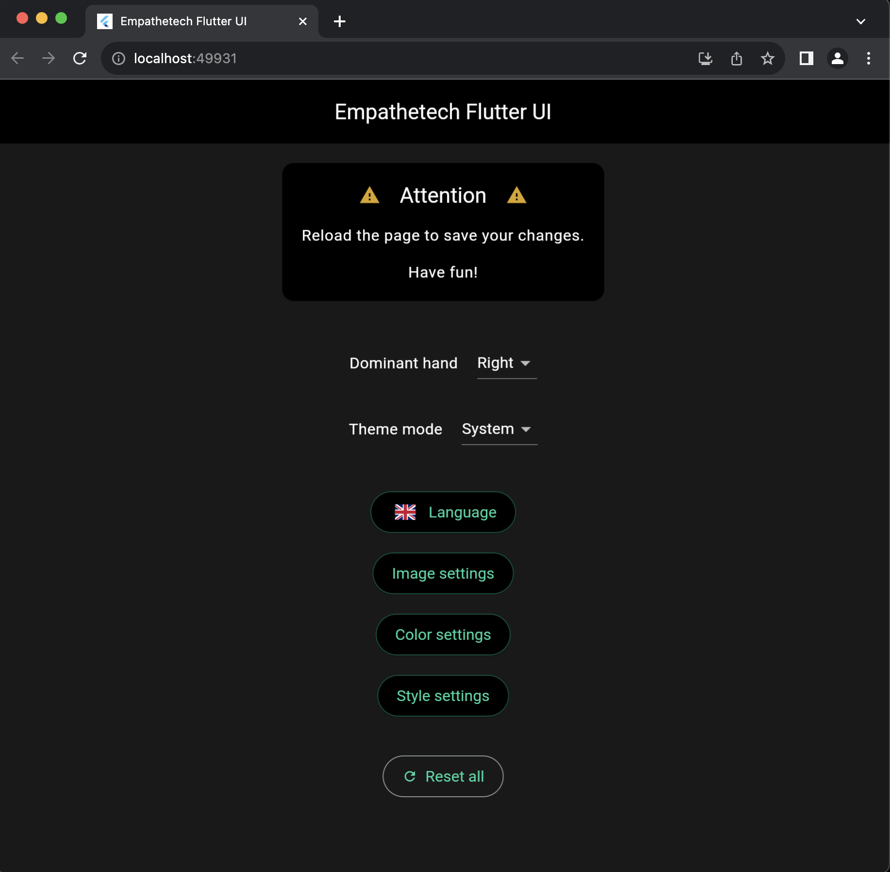 |

### User customization

| | | |
|---|---|---|
|  | 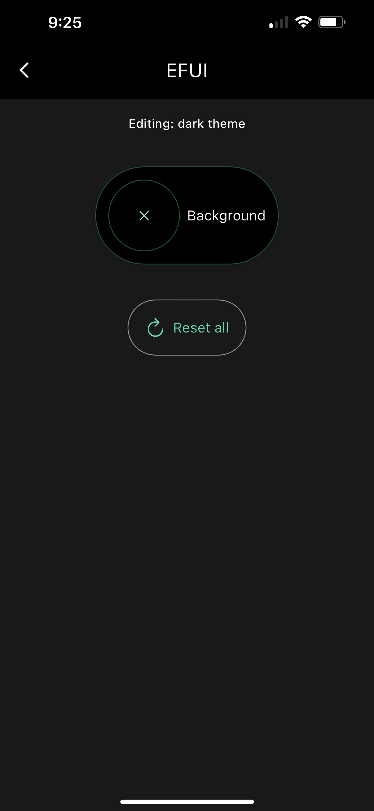 | 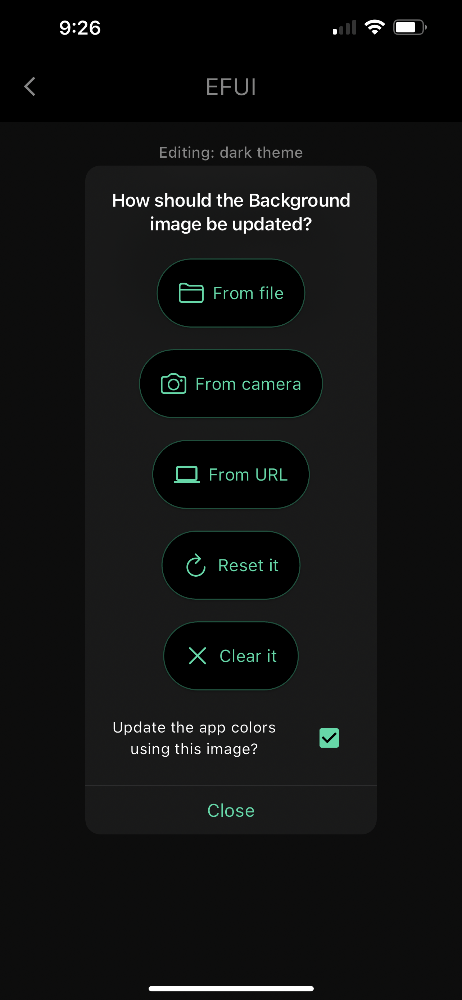 |
| 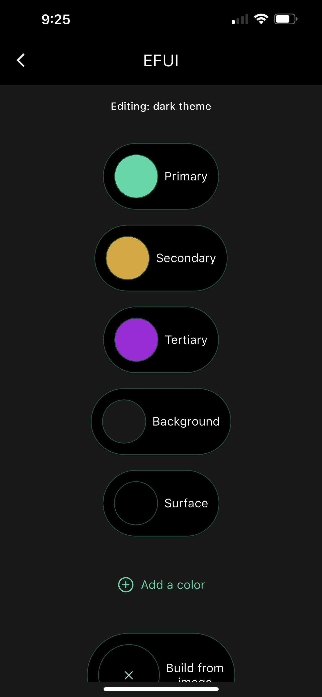 | 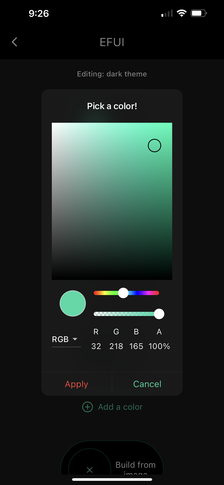 | 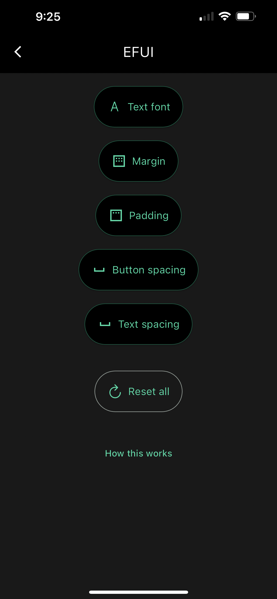 |
| 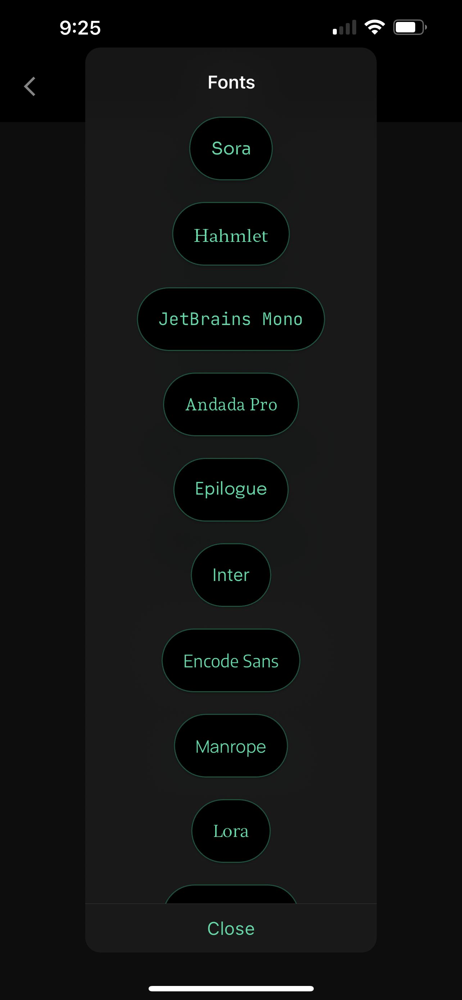 | 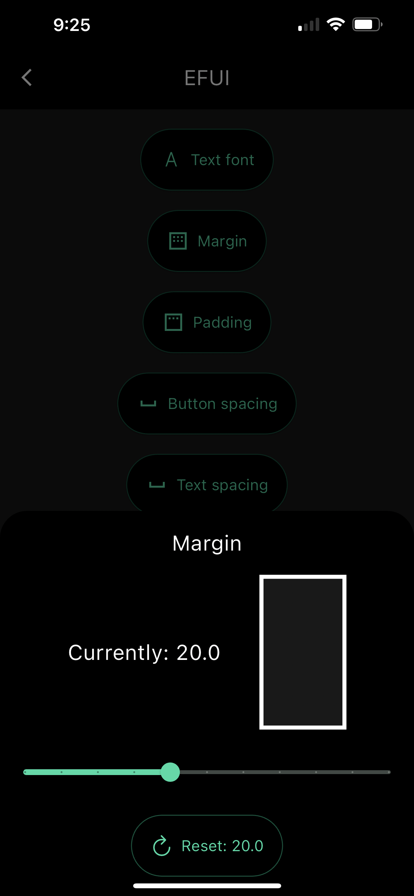 | 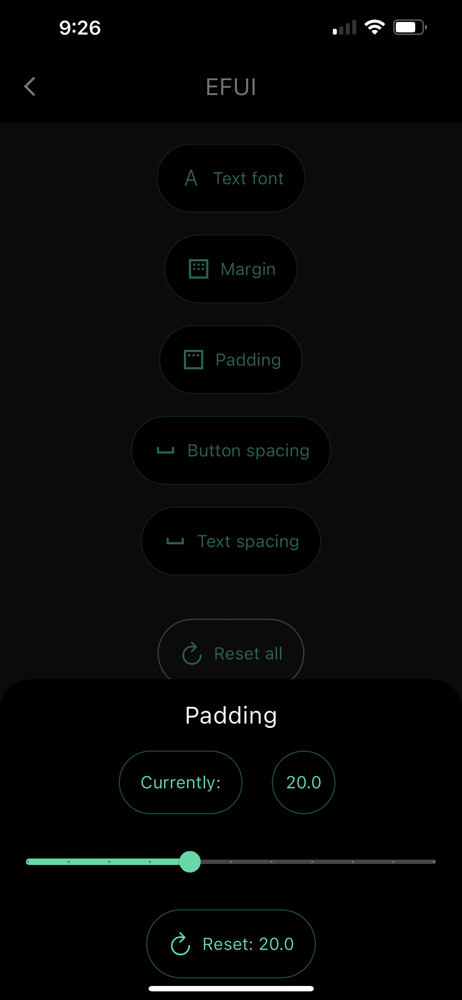 |

### Internationalization

| | | | |
|---|---|---|---|
| 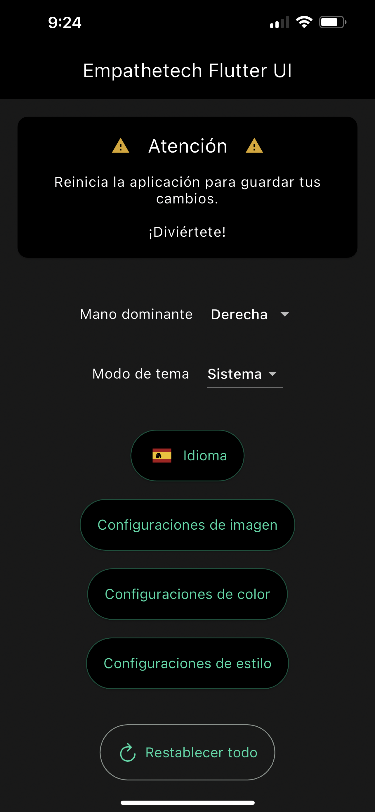 | 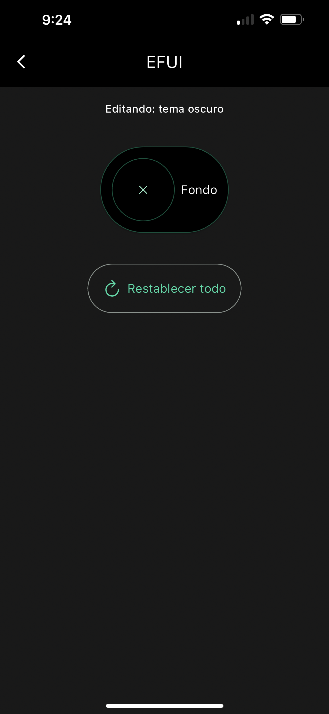 | 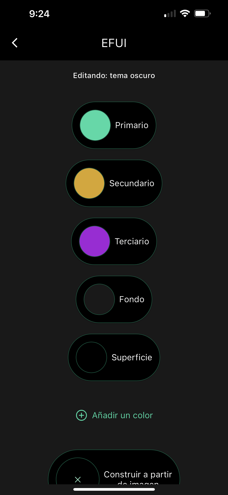 | 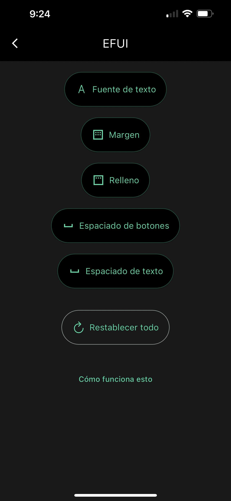 |

**Screen reader semantics are also internationalized!**

# Contributing

## The vibes!

If you build something with EFUI, let us know! We'd love to have a third-party live section

## Time

Please reach out to the [community](mailto:community@empathetech.net?subject=Becoming%20a%20contributor) contact about becoming a contributor. There's never a shortage of ideas, only time!

### More languages

If you speak English and a currently unsupported language, please reach out! The more the merrier.

## Money

Many thanks for any and all donations!

### Paypal

[](https://www.paypal.com/donate/?hosted_button_id=NGEL6AB5A6KNL)

### [Venmo](https://venmo.com/empathetech)

### [Cash App](https://cash.app/$empathetech)

### [Patreon](https://patreon.com/empathetech)

### [Buy Me a Coffee](https://www.buymeacoffee.com/empathetech)

### [Ko-fi](https://ko-fi.com/empathetech)

# License

[GNU GPLv3](LICENSE)

# Credits

## Translations

Thank you to [M Ramirez](https://www.linkedin.com/in/mauro-ramirez-rivas) for verifying EFUI's [Spanish](./lib/src/l10n/efui_es.arb) translations!

## Flutter OSS

EFUI wouldn't be as awesome as it is without these other awesome community projects...

* [Flutter Platform Widgets](https://pub.dev/packages/flutter_platform_widgets)
* [Flutter colorpicker](https://pub.dev/packages/flutter_colorpicker)
* [Line icons](https://pub.dev/packages/line_icons)
* [Localized Locales](https://pub.dev/packages/flutter_localized_locales)
* [Country flags](https://pub.dev/packages/country_flags)

And, of course, all the awesome Flutter devs...

* [Shared preferences](https://pub.dev/packages/shared_preferences)
* [URL launcher](https://pub.dev/packages/url_launcher)
* [Google fonts](https://pub.dev/packages/google_fonts)
* [Image picker](https://pub.dev/packages/image_picker)
* [path](https://pub.dev/packages/path)
* [path provider](https://pub.dev/packages/path_provider)
